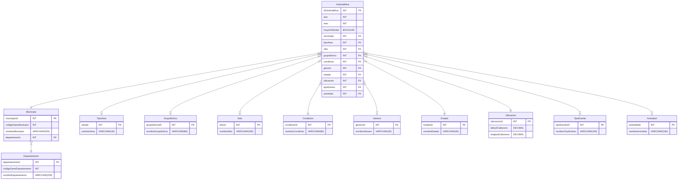

# Documentación

```mermaid
erDiagram

    Departamento {
        departamentoId INT PK 
        codigoDaneDepartamento INT 
        nombreDepartamento VARCHAR(255)
    }
    
    Municipio {
        municipioId INT PK 
        codigoDaneMunicipio INT 
        nombreMunicipio VARCHAR(255)
        departamento INT FK
    }
    
    TipoArea {
        areaId INT PK 
        nombreArea VARCHAR(40)
    }
    
    GrupoEtnico {
        grupoEtnicoID INT PK 
        nombreGrupoEtnico VARCHAR(80) 
    }
    
    Sitio {
        sitioId INT PK 
        nombreSitio VARCHAR(255) 
    }
    
    Condicion {
        condicionId INT PK 
        nombreCondicion VARCHAR(80) 
    }
    
    Genero {
        generoId INT PK 
        nombreGenero VARCHAR(40) 
    }
    
    Estado {
        estadoId INT PK 
        nombreEstado VARCHAR(40)
    }
    
    Ubicacion {
        ubicacionId INT PK 
        latitudCabecera DECIMAL 
        longitudCabecera DECIMAL
    }
    
    TipoEvento {
        tipoEventoID INT PK
        nombreTipoEvento VARCHAR(160)
    }
    
    Actividad {
        actividadId INT PK
        nombreActividad VARCHAR(160)
    }
    
    VictimaMina {
        idVictimaMina INT PK
        ano INT
        mes INT
        mayorDeEdad BOOLEAN
        municipio INT FK
        tipoArea INT FK
        sitio INT FK
        grupoEtnico INT FK
        condicion INT FK
        genero INT FK
        estado INT FK
        ubicacion INT FK
        tipoEvento INT FK
        actividad INT FK
    }
    
    VictimaMina }|--|| Municipio : ""
    VictimaMina }|--o| TipoArea : ""
    VictimaMina }|--o| Sitio : ""
    VictimaMina }|--o| GrupoEtnico : ""
    VictimaMina }|--|| Condicion : ""
    VictimaMina }|--o| Genero : ""
    VictimaMina }|--|| Estado : ""
    VictimaMina }|--|| Ubicacion : ""
    VictimaMina }|--o| TipoEvento : ""
    VictimaMina }|--o| Actividad : ""
    
    Municipio }|--|| Departamento : ""
```
